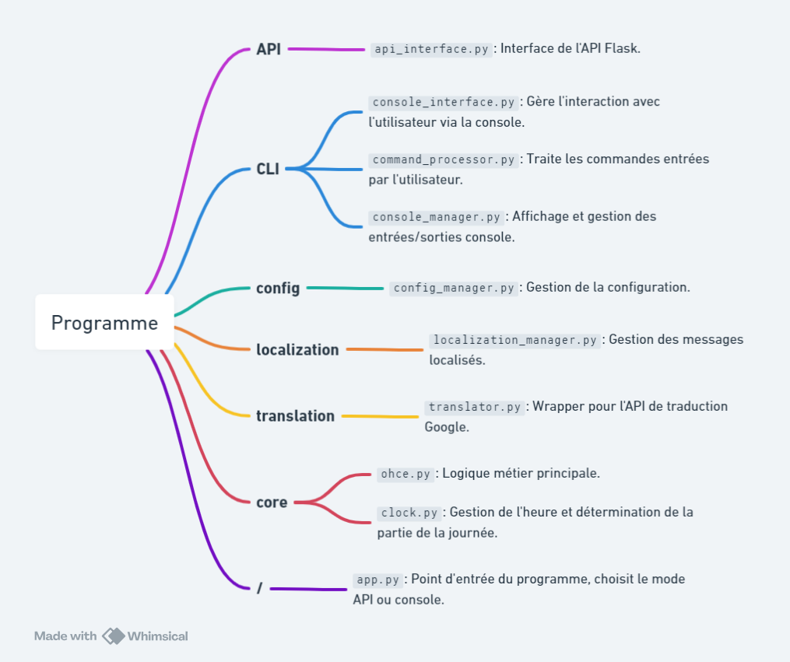
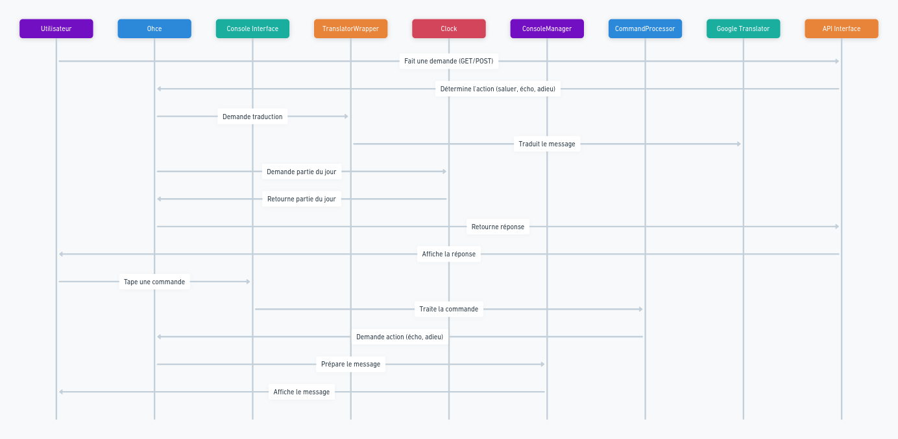

# OHCE_Hexagonal

L'application Ohce est un programme basé sur la console et sur le Web qui salue l'utilisateur, fait écho aux entrées et reconnaît les palindromes. Elle peut fonctionner en mode console pour une interaction directe ou être utilisée via une API Web pour une intégration avec d'autres services ou interfaces utilisateur.

## Installation

Pour exécuter l'application, vous aurez besoin de Python et de quelques dépendances. Suivez les étapes suivantes pour configurer votre environnement.

1. Clonez le dépôt ou téléchargez les fichiers sources.
2. Dans le répertoire du projet, créez un environnement virtuel Python :

    ```bash
    python -m venv venv
    ```

3. Activez l'environnement virtuel :

    - Sur Windows :

        ```bash
        venv\Scripts\activate
        ```

    - Sur Unix ou MacOS :

        ```bash
        source venv/bin/activate
        ```
    puis **rendez-vous à la racine du projet à l'aide de la commande** `cd`

4. Installez les dépendances nécessaires à l'aide de `requirements.txt` :

    ```bash
    pip install -r requirements.txt
    ```

5. Lancement des tests :
   
   ```bash
   pytest ./test/
   ```

6. En cas de problème, veuillez envoyer votre ordinateur au développeurs du projet

## Structure du Projet

Le projet est organisé en modules séparés pour suivre les principes de forte cohésion et de couplage faible :

- `translator.py` : Ce module encapsule la fonctionnalité de traduction. Il utilise la bibliothèque `googletrans` pour traduire les textes dans la langue souhaitée.

- `ohce.py` : Le cœur de la logique de l'application Ohce, qui fournit des fonctions pour saluer l'utilisateur, faire écho aux entrées et vérifier les palindromes.

- `console_interface.py` : Une interface en ligne de commande pour interagir avec l'utilisateur via la console.

- `api_interface.py` : Ce module utilise Flask pour exposer la logique Ohce en tant que service Web API.

- `app.py` : Le script principal qui détermine le mode de fonctionnement de l'application (console ou API) en fonction des arguments de la ligne de commande.

### architecture





## Utilisation

Pour démarrer l'application en mode console, exécutez :

```bash
python app.py
```

Pour démarrer l'application avec son interface API, exécutez :

```bash
python app.py api
```

Vous pouvez ensuite accéder à l'API localement via `http://127.0.0.1:5000/.`

💡après avoir lancé l'API, vous pouvez également la tester en ouvrant `api_chat/index.html` dans votre navigateur.


Merci d'utiliser l'application Ohce, bien qu'elle soit totalement inutile !

## Contribution

Pour contribuer au projet, vous pouvez envoyer tout votre argent aux développeurs 🤑

